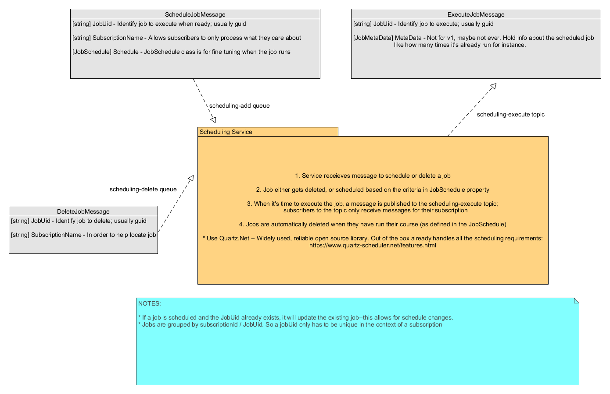

# AzureSchedulingService
A domain agnostic azure cloud scheduling service using quartz.net


NOTE: You will need to add appsettings.json to Application project with the following data:
```javascript
{
    "TopicName": "whatever",
    "AzureWebJobsServiceBus": "Service bus config string",
      "Quartz": {
      "quartz.threadPool.type": "Quartz.Simpl.SimpleThreadPool, Quartz",
      "quartz.threadPool.threadCount": "10",
      "quartz.threadPool.threadPriority": "Normal",
      "quartz.jobStore.misfireThreshold": "60000"
      ...
      }
}
```

For persisting jobs to DB, make sure Quartz is configured with a db connection string and run the sql script in the application project.

and an appsettings.json to the testing project that has the following shape:
```javascript
{
  "Azure":  {
    "AzureWebJobsServiceBus": "Service bus config string", 
    "SchedulingAddJobQueueName":  "scheduling-add",
    "SchedulingDeleteJobQueueName":  "scheduling-delete"
  } 
}
```

The logic will create a subscription if it doesn't exist, but keep in mind that an azure function listening to a subscription that doesn't exist will fail. The code will also ensure an existing subscription is configured to only receive execute messages for the specified subscription.

---

This is the high level design of how it works

